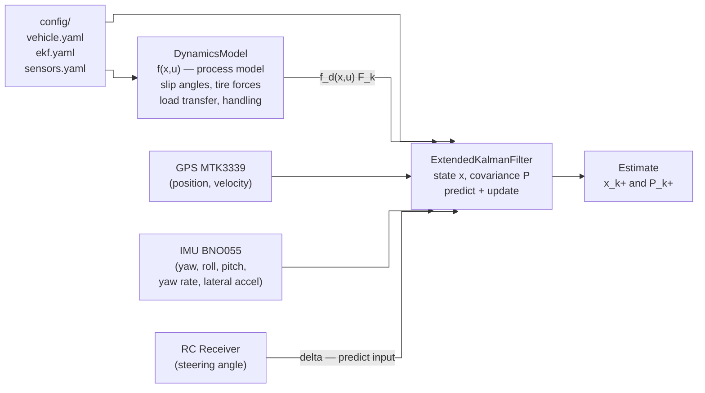
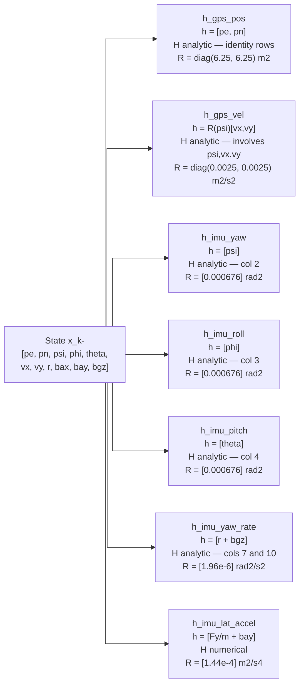
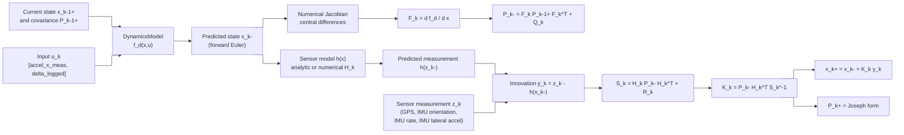
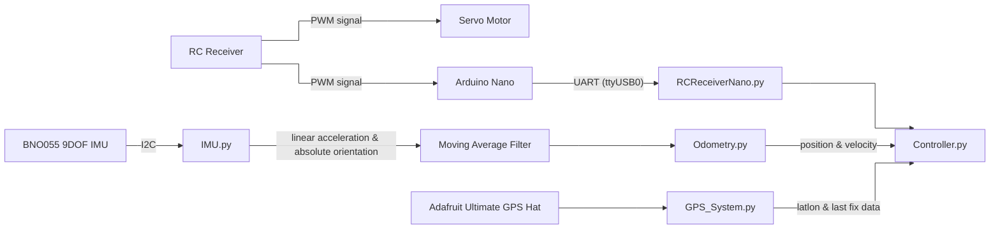

# EKF, Dynamics, and Odometry: Math Reference

This document explains the math implemented in `ExtendedKalmanFilter.py`, `DynamicsModel.py`, and `Odometry.py`, using the active values from `config/`.

**KaTeX notation:** inline math uses `$...$`, display math uses `$$...$$`. Position is $x$, velocity is $\dot{x}$, acceleration is $\ddot{x}$.

---

## 1. Purpose and Big Picture

The filter combines three pieces:

- the **dynamics model** predicts how the car should move one step forward in time
- the **sensor model** predicts what GPS and IMU should measure from a given state
- the **EKF** tracks both the estimate and the uncertainty, then blends predictions and measurements optimally

The nonlinear filtering equations are:

$$
\mathbf{x}_k = f(\mathbf{x}_{k-1}, \mathbf{u}_k) + \mathbf{w}_k, \qquad \mathbf{w}_k \sim \mathcal{N}(\mathbf{0}, \mathbf{Q}_k)
$$
$$
\mathbf{z}_k = h(\mathbf{x}_k) + \mathbf{v}_k, \qquad \mathbf{v}_k \sim \mathcal{N}(\mathbf{0}, \mathbf{R}_k)
$$

The EKF alternates between **predict** (dynamics model propagates the state forward) and **update** (each sensor corrects the propagated estimate).

---

## 2. Software Architecture

### File Roles

`DynamicsModel.py` owns the **process model** — the nonlinear continuous-time derivative $\dot{\mathbf{x}} = f(\mathbf{x}, \mathbf{u})$ derived from Newton's second law (single-track bicycle model). It also provides the discrete approximation $f_d$ used by the EKF predict step and computes derived quantities (slip angles, tire forces, load transfer, handling balance) useful for analysis.

`ExtendedKalmanFilter.py` owns the **filter state and covariance**. It calls `DynamicsModel` for the predict step and applies sensor corrections in the update step. No vehicle physics lives here.

`config/vehicle.yaml`, `config/ekf.yaml`, `config/sensors.yaml` are the single source of truth for all parameters. Both files load from these so changing a tire stiffness or a noise sigma propagates everywhere automatically.

The separation allows:
- developing and tuning the tire model without touching the filter
- swapping in a different motion model by modifying only `DynamicsModel.py`
- running the dynamics model standalone for simulation or analysis

### Why is the dynamics model needed?

A linear Kalman filter uses a constant transition matrix $\mathbf{F}$ that maps $\mathbf{x}_k = \mathbf{F}\mathbf{x}_{k-1}$ — only valid when motion is linear. For a vehicle, position derivatives depend on $\sin\psi$ and $\cos\psi$, and the lateral dynamics couple velocity, yaw rate, and steering nonlinearly. The EKF handles this by *linearising* $f$ at each step: it evaluates the full nonlinear model once to propagate the mean, then takes the Jacobian $\mathbf{F}_k = \partial f_d/\partial \mathbf{x}$ to propagate the covariance. The Jacobian is computed numerically using central differences.

### Software Architecture Diagram



---

## 3. Frames, Signs, and Config Parameters

From `config/frames.yaml`:

- Body frame: `+X` forward, `+Y` left, `+Z` up
- World frame: local ENU — $x$ = East, $y$ = North
- Yaw $\psi$ in radians, positive counter-clockwise from East
- Steering sign convention: `negative-left`, so $\delta_{\text{math}} = -\delta_{\text{logged}}$

### Vehicle parameters (`config/vehicle.yaml`)

| Symbol | Meaning | Value |
|---|---:|:---|
| $m$ | mass | 2.667 kg |
| $L$ | wheelbase | 0.3048 m |
| $a$ | front CG distance | 0.159512 m |
| $b$ | rear CG distance | 0.140208 m |
| $t$ | track width | 0.3048 m |
| $h$ | CG height | 0.066309 m |
| $I_z$ | yaw inertia | 0.6 kg·m² (placeholder — low confidence) |
| $C_f$ | front cornering stiffness | 60.0 N/rad |
| $C_r$ | rear cornering stiffness | 35.0 N/rad |
| $C_d$ | longitudinal drag coefficient | 0.0 |
| $v_{x,\min}$ | minimum safe longitudinal speed | 0.3 m/s |

### Sensor and filter noise parameters (`config/sensors.yaml`, `config/ekf.yaml`)

| Parameter | Meaning | Value |
|---|---:|:---|
| $\sigma_{\text{gps,pos}}$ | GPS position sigma | 2.5 m |
| $\sigma_{\text{gps,vel}}$ | GPS velocity sigma | 0.05 m/s |
| $\sigma_{\psi}$ | IMU yaw sigma | 0.026 rad |
| $\sigma_{\phi}$ | IMU roll sigma | 0.026 rad |
| $\sigma_{\theta}$ | IMU pitch sigma | 0.026 rad |
| $\sigma_r$ | IMU yaw-rate sigma | 0.0014 rad/s |
| $\sigma_{a_y}$ | IMU lateral accel sigma | 0.012 m/s² |
| $\sigma_{\text{model,vel}}$ | velocity process sigma | 1.5 m/s² |
| $\sigma_{\text{model,yaw}}$ | yaw-accel process sigma | 2.0 rad/s² |
| $\sigma_{b_a}$ | accel-bias walk sigma | 0.05 m/s³ |
| $\sigma_{b_g}$ | gyro-bias walk sigma | 0.01 rad/s² |

---

## 4. State, Input, and Measurement Definitions

### State vector (11 elements)

$$
\mathbf{x} =
\begin{bmatrix}
x_e \\ x_n \\ \psi \\ \phi \\ \theta \\ \dot{x}_x \\ \dot{x}_y \\ r \\ b_{ax} \\ b_{ay} \\ b_{gz}
\end{bmatrix}
$$

| Index | Symbol | Description |
|---:|:---:|:---|
| 0 | $x_e$ | East position (m) |
| 1 | $x_n$ | North position (m) |
| 2 | $\psi$ | yaw angle, CCW from East (rad) |
| 3 | $\phi$ | roll angle (rad) |
| 4 | $\theta$ | pitch angle (rad) |
| 5 | $\dot{x}_x$ | body-frame longitudinal velocity (m/s) |
| 6 | $\dot{x}_y$ | body-frame lateral velocity (m/s) |
| 7 | $r$ | yaw rate (rad/s) |
| 8 | $b_{ax}$ | IMU longitudinal accelerometer bias (m/s²) |
| 9 | $b_{ay}$ | IMU lateral accelerometer bias (m/s²) |
| 10 | $b_{gz}$ | IMU gyro z-axis bias (rad/s) |

Roll $\phi$ and pitch $\theta$ are treated as **random-walk states** in the predict step (derivative = 0) and corrected every loop iteration by the BNO055 NDOF orientation measurements. $b_{ay}$ captures any systematic offset in the lateral accelerometer axis.

### Control input

$$
\mathbf{u} = \begin{bmatrix} \ddot{x}_{x,\text{meas}} \\ \delta_{\text{logged}} \end{bmatrix}
$$

### Active measurement channels

| Sensor | Measurement | Rate | Notes |
|:---|:---|---:|:---|
| GPS MTK3339 | position $(x_e, x_n)$ | 1–10 Hz | $\sigma \approx 2.5$ m — deliberately low weight |
| GPS MTK3339 | ENU velocity | 1–10 Hz | $\sigma \approx 0.05$ m/s — much more reliable than position |
| BNO055 NDOF | yaw $\psi$ | 100 Hz | Euler angles, $\sigma \approx 0.026$ rad |
| BNO055 NDOF | roll $\phi$ | 100 Hz | Euler angles, $\sigma \approx 0.026$ rad |
| BNO055 NDOF | pitch $\theta$ | 100 Hz | Euler angles, $\sigma \approx 0.026$ rad |
| BNO055 NDOF | gyro z (yaw rate) | 100 Hz | $\sigma \approx 0.0014$ rad/s |
| BNO055 NDOF | lateral linear accel | 100 Hz | gravity-removed, $\sigma \approx 0.012$ m/s² |

---

## 5. DynamicsModel.py: Nonlinear Vehicle Motion Model

### 5.1 Body-to-World Rotation

The 2D yaw rotation maps body velocity into the world (ENU) frame:

$$
\mathbf{R}(\psi) = \begin{bmatrix}\cos\psi & -\sin\psi\\\sin\psi & \cos\psi\end{bmatrix}
$$

$$
\begin{bmatrix}\dot{x}_e\\\dot{x}_n\end{bmatrix}
= \mathbf{R}(\psi)\begin{bmatrix}\dot{x}_x\\\dot{x}_y\end{bmatrix}
= \begin{bmatrix}\dot{x}_x\cos\psi - \dot{x}_y\sin\psi\\\dot{x}_x\sin\psi + \dot{x}_y\cos\psi\end{bmatrix}
$$

### 5.2 Slip Angles

The speed clamp avoids division by zero while preserving the direction of travel in reverse:

$$
\dot{x}_{x,\text{safe}} = \operatorname{sign}(\dot{x}_x)\max(|\dot{x}_x|,\; 0.3)
$$

Tire slip angles (small-angle linear approximation):

$$
\alpha_f = \delta_{\text{math}} - \frac{\dot{x}_y + a r}{\dot{x}_{x,\text{safe}}},
\qquad
\alpha_r = -\frac{\dot{x}_y - b r}{\dot{x}_{x,\text{safe}}}
$$

The numerator $(\dot{x}_y + ar)$ is the lateral velocity of the *front axle* — the sum of CG lateral velocity and the rotational contribution $a \cdot r$. Dividing by $\dot{x}_x$ converts it to an angle. The front steering angle $\delta_\text{math}$ is how much the front wheel is turned away from that travel direction. The rear axle has no steering, so $\alpha_r$ is purely the sideslip at the rear.

With active config values:

$$
\alpha_f = \delta_{\text{math}} - \frac{\dot{x}_y + 0.159512\,r}{\dot{x}_{x,\text{safe}}},
\qquad
\alpha_r = -\frac{\dot{x}_y - 0.140208\,r}{\dot{x}_{x,\text{safe}}}
$$

### 5.3 Linear Lateral Tire Forces

$$
F_{yf} = 2C_f\alpha_f = 120\,\alpha_f \text{ N},
\qquad
F_{yr} = 2C_r\alpha_r = 70\,\alpha_r \text{ N}
$$

### 5.4 Bias-Corrected Longitudinal Acceleration

$$
\ddot{x}_{x,\text{corr}} = \ddot{x}_{x,\text{meas}} - b_{ax}
$$

### 5.5 Continuous-Time State Derivative (Full 11-State)

The implemented nonlinear derivative $\dot{\mathbf{x}} = f(\mathbf{x}, \mathbf{u})$:

$$
\begin{aligned}
\dot{x}_e &= \dot{x}_x\cos\psi - \dot{x}_y\sin\psi \\
\dot{x}_n &= \dot{x}_x\sin\psi + \dot{x}_y\cos\psi \\
\dot{\psi} &= r \\
\dot{\phi} &= 0 \quad \text{(random walk; corrected by IMU each step)} \\
\dot{\theta} &= 0 \quad \text{(random walk; corrected by IMU each step)} \\
\ddot{x}_x &= \ddot{x}_{x,\text{corr}} + \dot{x}_y r - C_d\dot{x}_x|\dot{x}_x| \\
\ddot{x}_y &= -\dot{x}_x r + \frac{F_{yf}\cos\delta_{\text{math}} + F_{yr}}{m} \\
\dot{r} &= \frac{a F_{yf}\cos\delta_{\text{math}} - b F_{yr}}{I_z} \\
\dot{b}_{ax} &= 0, \quad \dot{b}_{ay} = 0, \quad \dot{b}_{gz} = 0
\end{aligned}
$$

Because $C_d = 0$ in the current config: $\ddot{x}_x = \ddot{x}_{x,\text{corr}} + \dot{x}_y r$.

Substituting active config values:

$$
\ddot{x}_y = -\dot{x}_x r + \frac{120\,\alpha_f\cos\delta_{\text{math}} + 70\,\alpha_r}{2.667}
$$
$$
\dot{r} = \frac{0.159512\cdot120\,\alpha_f\cos\delta_{\text{math}} - 0.140208\cdot70\,\alpha_r}{0.6}
$$

**Why $\dot{\phi} = \dot{\theta} = 0$?** The BNO055 NDOF fusion provides roll and pitch at 100 Hz with $\sigma \approx 0.026$ rad. Rather than trying to model roll/pitch dynamics (which would require full 3D equations and suspension knowledge we don't have), we let $Q$ inject small uncertainty each predict step and correct aggressively with the high-frequency IMU orientation updates. The net effect is that $\phi$ and $\theta$ in the filter track the IMU almost directly, while their coupling into the planar velocity states through tilt-induced gravity projections remains available for future expansion.

### 5.6 Discrete-Time Process Model

The EKF uses forward Euler discretization:

$$
\mathbf{x}_k^- = f_d(\mathbf{x}_{k-1}^+, \mathbf{u}_k) \approx \mathbf{x}_{k-1}^+ + f(\mathbf{x}_{k-1}^+, \mathbf{u}_k)\,\Delta t
$$

After propagation, yaw and roll are wrapped to $[-\pi, \pi)$:

$$
\psi \leftarrow \operatorname{atan2}(\sin\psi,\cos\psi), \qquad \phi \leftarrow \operatorname{atan2}(\sin\phi,\cos\phi)
$$

---

## 6. State-Transition Jacobian $\mathbf{F}_k$

### 6.1 What $\mathbf{F}_k$ Is

The state-transition Jacobian is the local linearisation of the discrete nonlinear process model:

$$
\mathbf{F}_k = \left.\frac{\partial f_d}{\partial \mathbf{x}}\right|_{\mathbf{x}_{k-1}^+,\,\mathbf{u}_k}
$$

In plain language: *if the current state estimate shifts a little in any direction, $\mathbf{F}_k$ tells the EKF how much the next predicted state shifts in response.* That is why it appears inside the covariance prediction:

$$
\mathbf{P}_k^- = \mathbf{F}_k \mathbf{P}_{k-1}^+ \mathbf{F}_k^T + \mathbf{Q}_k
$$

Think of $\mathbf{P}$ as an ellipsoid of uncertainty. $\mathbf{F}_k \mathbf{P} \mathbf{F}_k^T$ stretches and rotates the ellipsoid according to how the nonlinear dynamics would distort a small cloud of nearby states. $\mathbf{Q}_k$ inflates it to account for unmodelled forces and bias drift.

### 6.2 Physical Meaning of the Non-Zero Entries

From the analytic continuous-time Jacobian $\mathbf{A} = \partial f/\partial \mathbf{x}$:

- $A_{0,2}$, $A_{1,2}$: uncertainty in yaw $\psi$ maps into uncertainty in the *direction* of position change — if you are not sure which way the car is pointing, you do not know which way it is moving in the world frame.
- $A_{2,7} = 1$: uncertainty in $r$ (yaw rate) feeds directly into $\dot{\psi}$ — obvious from $\dot{\psi} = r$.
- $A_{5,6}$, $A_{6,5}$: $\dot{x}_x$ and $\dot{x}_y$ couple through the centripetal terms $\dot{x}_y r$ and $-\dot{x}_x r$.
- $A_{5,8} = -1$: the accelerometer bias state directly reduces the effective longitudinal acceleration — uncertainty in $b_{ax}$ maps to uncertainty in $\ddot{x}_x$.
- Rows 3 and 4 ($\phi$, $\theta$) are all zero — roll and pitch have zero process derivative, so they contribute nothing to the predicted state but their covariance grows each step via $Q$.

### 6.3 Analytic Continuous-Time Jacobian (for intuition)

Using column indices $[x_e, x_n, \psi, \phi, \theta, \dot{x}_x, \dot{x}_y, r, b_{ax}, b_{ay}, b_{gz}]$ and letting $c = \cos\psi$, $s = \sin\psi$:

$$
\mathbf{A} = \left.\frac{\partial f}{\partial \mathbf{x}}\right|_{\mathbf{x}}
$$

The dominant off-diagonal terms are:

$$
\begin{aligned}
A_{0,2} &= -\dot{x}_x\sin\psi - \dot{x}_y\cos\psi \\
A_{1,2} &= \dot{x}_x\cos\psi - \dot{x}_y\sin\psi \\
A_{5,5} &= -2C_d|\dot{x}_x| \qquad (= 0 \text{ with current } C_d=0)\\
A_{6,5} &= -r + \frac{2C_f\cos\delta({\dot{x}_y + ar}) + 2C_r(\dot{x}_y - br)}{m\,\dot{x}_{x,\text{safe}}^2} \\
A_{6,6} &= \frac{-2C_f\cos\delta - 2C_r}{m\,\dot{x}_{x,\text{safe}}} \\
A_{6,7} &= -\dot{x}_x + \frac{-2aC_f\cos\delta + 2bC_r}{m\,\dot{x}_{x,\text{safe}}} \\
A_{7,5} &= \frac{2aC_f\cos\delta(\dot{x}_y + ar) - 2bC_r(\dot{x}_y - br)}{I_z\,\dot{x}_{x,\text{safe}}^2} \\
A_{7,6} &= \frac{-2aC_f\cos\delta + 2bC_r}{I_z\,\dot{x}_{x,\text{safe}}} \\
A_{7,7} &= \frac{-2a^2C_f\cos\delta - 2b^2C_r}{I_z\,\dot{x}_{x,\text{safe}}}
\end{aligned}
$$

For forward Euler:

$$
\mathbf{F}_k \approx \mathbf{I} + \mathbf{A}_k\,\Delta t
$$

### 6.4 Numerical Computation

The code does not use the symbolic matrix directly. It computes $\mathbf{F}_k$ with central differences:

$$
\mathbf{F}_k[:,i] = \frac{f_d(\mathbf{x}+\varepsilon\mathbf{e}_i,\mathbf{u}) - f_d(\mathbf{x}-\varepsilon\mathbf{e}_i,\mathbf{u})}{2\varepsilon}, \qquad \varepsilon = 10^{-6}
$$

---

## 7. Process-Noise Matrix $\mathbf{Q}$

$\mathbf{Q}_k$ is the honest admission that the dynamics model is imperfect. Every source of uncertainty not captured by `DynamicsModel.py` must be accounted for here.

**Sources of process noise for this project:**
- *Unmodelled tyre forces* — the linear tyre model $F = 2C\alpha$ is only accurate at small slip angles; it saturates during hard cornering.
- *Ground disturbances* — bumps and surface variation cause accelerations absent from the planar model.
- *Unmodelled aerodynamics* — drag is set to zero; air resistance and downforce are ignored.
- *IMU bias drift* — biases are modelled as constants ($\dot{b} = 0$) but real biases drift slowly with temperature. $\mathbf{Q}$ injects small uncertainty each step so the filter stays willing to let them change.
- *Roll and pitch dynamics* — $\dot{\phi} = \dot{\theta} = 0$ is a deliberate simplification; $\mathbf{Q}$ keeps those estimates responsive between high-rate IMU updates.

The current $\mathbf{Q}$ is diagonal (states treated as uncorrelated in their noise):

$$
\mathbf{Q}(\Delta t) = \operatorname{diag}\!\left(
10^{-4},\;
10^{-4},\;
(\sigma_{\dot\psi}\Delta t)^2,\;
(\sigma_\phi\Delta t)^2,\;
(\sigma_\theta\Delta t)^2,\;
(\sigma_v\Delta t)^2,\;
(\sigma_v\Delta t)^2,\;
(\sigma_{\dot\psi}\Delta t)^2,\;
(\sigma_{b_a}\Delta t)^2,\;
(\sigma_{b_a}\Delta t)^2,\;
(\sigma_{b_g}\Delta t)^2
\right)
$$

Numerically (per state, at $\Delta t = 0.01$ s for a 100 Hz IMU loop):

| Index | State | $Q$ entry |
|---:|:---:|:---|
| 0 | $x_e$ | $10^{-4}$ (position integration error is small) |
| 1 | $x_n$ | $10^{-4}$ |
| 2 | $\psi$ | $(2.0\,\Delta t)^2$ |
| 3 | $\phi$ | $(0.026\,\Delta t)^2$ |
| 4 | $\theta$ | $(0.026\,\Delta t)^2$ |
| 5 | $\dot{x}_x$ | $(1.5\,\Delta t)^2$ |
| 6 | $\dot{x}_y$ | $(1.5\,\Delta t)^2$ |
| 7 | $r$ | $(2.0\,\Delta t)^2$ |
| 8 | $b_{ax}$ | $(0.05\,\Delta t)^2$ |
| 9 | $b_{ay}$ | $(0.05\,\Delta t)^2$ |
| 10 | $b_{gz}$ | $(0.01\,\Delta t)^2$ |

**Tuning note:** $\mathbf{Q}$ is currently set from engineering intuition. The proper method is to run the filter on logged data and check the *normalised innovation squared* (NIS) — the ratio of innovation magnitude to predicted innovation covariance — against a $\chi^2$ distribution. If NIS is consistently too large, the filter is over-confident in the model and $\mathbf{Q}$ should be increased.

---

## 8. Predict Step

Predict runs every loop iteration, driven by IMU longitudinal acceleration and steering angle:

$$
\mathbf{x}_k^- = f_d(\mathbf{x}_{k-1}^+, \mathbf{u}_k)
$$
$$
\mathbf{F}_k = \left.\frac{\partial f_d}{\partial \mathbf{x}}\right|_{\mathbf{x}_{k-1}^+,\,\mathbf{u}_k}
$$
$$
\mathbf{P}_k^- = \mathbf{F}_k \mathbf{P}_{k-1}^+ \mathbf{F}_k^T + \mathbf{Q}_k
$$

### Initial Covariance $\mathbf{P}_0$

From `config/ekf.yaml`, using $\text{rad}(\theta) = \pi\theta/180$:

$$
\mathbf{P}_0 = \operatorname{diag}\!\left(
10^2,\;
10^2,\;
\text{rad}(30)^2,\;
\text{rad}(10)^2,\;
\text{rad}(10)^2,\;
2^2,\;
2^2,\;
\text{rad}(20)^2,\;
1^2,\;
1^2,\;
\text{rad}(5)^2
\right)
$$

---

## 9. Sensor Models and H Matrices

Each measurement channel defines $\mathbf{z}_k = h(\mathbf{x}_k) + \mathbf{v}_k$ and its Jacobian $\mathbf{H}_k = \partial h/\partial \mathbf{x}\big|_{\mathbf{x}_k^-}$.

The 11-state column ordering for all H matrices is:

$$
[\underbrace{x_e}_{0},\; \underbrace{x_n}_{1},\; \underbrace{\psi}_{2},\; \underbrace{\phi}_{3},\; \underbrace{\theta}_{4},\; \underbrace{\dot{x}_x}_{5},\; \underbrace{\dot{x}_y}_{6},\; \underbrace{r}_{7},\; \underbrace{b_{ax}}_{8},\; \underbrace{b_{ay}}_{9},\; \underbrace{b_{gz}}_{10}]
$$

### 9.1 GPS Position

$$
h_{\text{pos}}(\mathbf{x}) = \begin{bmatrix}x_e\\x_n\end{bmatrix},
\qquad
\mathbf{H}_{\text{pos}} = \begin{bmatrix}
1 & 0 & 0 & 0 & 0 & 0 & 0 & 0 & 0 & 0 & 0 \\
0 & 1 & 0 & 0 & 0 & 0 & 0 & 0 & 0 & 0 & 0
\end{bmatrix}
$$

$$
\mathbf{R}_{\text{pos}} = \operatorname{diag}(2.5^2,\;2.5^2) = \operatorname{diag}(6.25,\;6.25)\;\text{m}^2
$$

If gpsd reports $e_{px}$, $e_{py}$, those are used instead: $\mathbf{R}_{\text{pos}} = \operatorname{diag}(e_{px}^2,\; e_{py}^2)$.

**Note on GPS position accuracy:** The 2.5 m sigma is intentionally large. For an RC car (wheelbase 0.30 m), GPS position alone is nearly useless for local path planning. The filter carries GPS position only to prevent long-term position drift during sessions where the dynamics accumulate error. GPS *velocity* is far more reliable ($\sigma \approx 0.05$ m/s) and carries most of the GPS information at speed.

### 9.2 GPS Velocity (analytic H)

GPS reports speed and course-over-ground (ENU world frame). The state stores body-frame velocity, so the measurement model applies the yaw rotation:

$$
h_{\text{vel}}(\mathbf{x}) = \mathbf{R}(\psi)\begin{bmatrix}\dot{x}_x\\\dot{x}_y\end{bmatrix}
= \begin{bmatrix}\dot{x}_x\cos\psi - \dot{x}_y\sin\psi\\\dot{x}_x\sin\psi + \dot{x}_y\cos\psi\end{bmatrix}
$$

Because $h_\text{vel}$ is nonlinear in $\psi$, $\dot{x}_x$, and $\dot{x}_y$, the EKF needs an analytic Jacobian. Differentiating each output with respect to each state (letting $c = \cos\psi$, $s = \sin\psi$):

$$
\frac{\partial}{\partial\psi}(\dot{x}_x c - \dot{x}_y s) = -\dot{x}_x s - \dot{x}_y c, \quad
\frac{\partial}{\partial\dot{x}_x}(\cdot) = c, \quad
\frac{\partial}{\partial\dot{x}_y}(\cdot) = -s
$$

All other partial derivatives are zero, giving the 2×11 Jacobian:

$$
\mathbf{H}_{\text{vel}} = \begin{bmatrix}
0 & 0 & -\dot{x}_x s - \dot{x}_y c & 0 & 0 & c & -s & 0 & 0 & 0 & 0 \\
0 & 0 & \phantom{-}\dot{x}_x c - \dot{x}_y s & 0 & 0 & s & \phantom{-}c & 0 & 0 & 0 & 0
\end{bmatrix}
$$

Providing this analytically saves 22 extra process-model evaluations per GPS velocity update (11 state dimensions × 2 perturbation directions for central differences).

$$
\mathbf{R}_{\text{vel}} = \operatorname{diag}(0.05^2,\;0.05^2) = \operatorname{diag}(0.0025,\;0.0025)\;\text{m}^2/\text{s}^2
$$

This update is skipped when reported speed is below 0.2 m/s to avoid ill-conditioned Jacobians at near-zero velocity.

### 9.3 IMU Yaw

$$
h_\psi(\mathbf{x}) = [\psi], \qquad \mathbf{H}_\psi = [0\;0\;1\;0\;0\;0\;0\;0\;0\;0\;0], \qquad \mathbf{R}_\psi = [0.026^2]
$$

Innovation is wrapped to $[-\pi,\pi)$ before the update.

### 9.4 IMU Roll (NEW)

The BNO055 NDOF fusion reports full Euler orientation. Roll maps directly to the $\phi$ state:

$$
h_\phi(\mathbf{x}) = [\phi], \qquad \mathbf{H}_\phi = [0\;0\;0\;1\;0\;0\;0\;0\;0\;0\;0], \qquad \mathbf{R}_\phi = [0.026^2]
$$

Innovation is wrapped to $[-\pi,\pi)$.

### 9.5 IMU Pitch (NEW)

$$
h_\theta(\mathbf{x}) = [\theta], \qquad \mathbf{H}_\theta = [0\;0\;0\;0\;1\;0\;0\;0\;0\;0\;0], \qquad \mathbf{R}_\theta = [0.026^2]
$$

### 9.6 IMU Yaw Rate

The gyro z-axis sees yaw rate plus the estimated gyro bias:

$$
h_r(\mathbf{x}) = [r + b_{gz}], \qquad \mathbf{H}_r = [0\;0\;0\;0\;0\;0\;0\;1\;0\;0\;1], \qquad \mathbf{R}_r = [0.0014^2] = [1.96\times10^{-6}]
$$

### 9.7 IMU Lateral Acceleration (NEW, numerical H)

The BNO055 gravity-compensated lateral linear acceleration in the body frame is:

$$
a_{\text{linear},y} = \dot{v}_y + \dot{x}_x r
$$

Substituting the dynamics equation $\dot{v}_y = -\dot{x}_x r + (F_{yf}\cos\delta + F_{yr})/m$:

$$
a_{\text{linear},y} = -\dot{x}_x r + \frac{F_{yf}\cos\delta + F_{yr}}{m} + \dot{x}_x r = \frac{F_{yf}\cos\delta + F_{yr}}{m}
$$

The centripetal term $\dot{x}_x r$ cancels exactly. The BNO055 lateral reading is precisely the lateral tire force divided by mass. The measurement model is:

$$
h_\text{lat}(\mathbf{x},\delta) = \frac{F_{yf}(\mathbf{x})\cos\delta_\text{math} + F_{yr}(\mathbf{x})}{m} + b_{ay}
$$

where $F_{yf}$ and $F_{yr}$ depend nonlinearly on $\dot{x}_x$, $\dot{x}_y$, and $r$ through the slip angles. The Jacobian $\mathbf{H}_\text{lat}$ is computed numerically via central differences. $b_{ay}$ (index 9) captures any systematic offset in the lateral axis. This update is skipped below the configured low-speed threshold (0.2 m/s) where the tire-force model is unreliable.

$$
\mathbf{R}_\text{lat} = [0.012^2] = [1.44\times10^{-4}]\;\text{m}^2/\text{s}^4
$$

### Sensor Measurement Models Overview



---

## 10. Update Step

For any measurement update, the EKF computes:

$$
\mathbf{y}_k = \mathbf{z}_k - h(\mathbf{x}_k^-)
$$

$$
\mathbf{S}_k = \mathbf{H}_k \mathbf{P}_k^- \mathbf{H}_k^T + \mathbf{R}_k
$$

$$
\mathbf{K}_k = \mathbf{P}_k^- \mathbf{H}_k^T \mathbf{S}_k^{-1}
$$

$$
\mathbf{x}_k^+ = \mathbf{x}_k^- + \mathbf{K}_k \mathbf{y}_k
$$

where $\mathbf{y}_k$ is the innovation (residual), $\mathbf{S}_k$ is the innovation covariance, and $\mathbf{K}_k$ is the Kalman gain.

**Intuition for $\mathbf{K}_k$:** it decides how much to trust the sensor versus the model prediction. If $\mathbf{R}$ is small (sensor trusted), $\mathbf{K}$ is large and the state is pulled toward the measurement. If $\mathbf{P}^-$ is small (model trusted), $\mathbf{K}$ is small and the measurement has little influence.

**Joseph-form covariance update** (used in code for numerical stability):

$$
\mathbf{P}_k^+ = (\mathbf{I}-\mathbf{K}_k\mathbf{H}_k)\mathbf{P}_k^-(\mathbf{I}-\mathbf{K}_k\mathbf{H}_k)^T + \mathbf{K}_k\mathbf{R}_k\mathbf{K}_k^T
$$

This is more expensive than the minimal form $\mathbf{P}^+ = (\mathbf{I}-\mathbf{K}\mathbf{H})\mathbf{P}^-$ but stays symmetric and positive-definite under floating-point rounding, which matters for long runs. The code uses `np.linalg.solve` instead of an explicit matrix inverse for the Kalman gain computation.

Angle residuals ($\psi$ and $\phi$ updates) are wrapped to $[-\pi,\pi)$ before the state correction is applied.

---

## 11. GPS Initialization and Coordinate Conversion

The filter defines a local ENU origin from the first good GPS fix and converts lat/lon to local meters:

$$
\text{m/deg}_\text{lat} = 111320, \qquad \text{m/deg}_\text{lon} = 111320\cos(\text{lat}_0)
$$

$$
x_e = (\text{lon} - \text{lon}_0)\cdot\text{m/deg}_\text{lon}, \qquad x_n = (\text{lat} - \text{lat}_0)\cdot\text{m/deg}_\text{lat}
$$

GPS course-over-ground to ENU yaw:

$$
\psi = \operatorname{wrap}\!\left(\frac{\pi}{2} - \operatorname{deg2rad}(\text{track}_\text{deg})\right)
$$

GPS speed and track to ENU velocity, then rotated to the body frame:

$$
\begin{bmatrix}v_e\\v_n\end{bmatrix} = \begin{bmatrix}\text{speed}\cos\psi\\\text{speed}\sin\psi\end{bmatrix},
\qquad
\begin{bmatrix}\dot{x}_x\\\dot{x}_y\end{bmatrix} = \begin{bmatrix}\cos\psi & \sin\psi\\-\sin\psi & \cos\psi\end{bmatrix}\begin{bmatrix}v_e\\v_n\end{bmatrix}
$$

---

## 12. Load Transfer and Handling Balance

`DynamicsModel.py` computes first-pass body accelerations and longitudinal/lateral load transfer for analysis:

$$
A_x = \ddot{x}_{x,\text{meas}} - b_{ax}, \qquad A_y = \frac{F_{yf}\cos\delta_\text{math} + F_{yr}}{m}
$$

$$
W = mg = 2.667\cdot9.80665 = 26.154\;\text{N}
$$

$$
\Delta W_x = W\!\left(\frac{A_x h}{L}\right) \approx 5.687\,A_x \;\text{N},
\qquad
\Delta W_y = W\!\left(\frac{A_y h}{t}\right) \approx 5.687\,A_y \;\text{N}
$$

(The approximation holds because $L = t = 0.3048$ m in the current config, so $h/L = h/t \approx 0.2175$.)

**Handling balance heuristic:**

- understeer if $|\alpha_f| > |\alpha_r| + 1°$
- oversteer if $|\alpha_r| > |\alpha_f| + 1°$
- otherwise neutral

**Ackermann steering reference:**

$$
\delta_\text{ack} = \arctan\!\left(\frac{L}{R}\right) = \arctan\!\left(\frac{0.3048}{R}\right)
$$

---

## 13. Odometry (Dead Reckoning)

`Odometry.py` is not a Kalman filter. It performs direct IMU-based dead reckoning without a covariance matrix. It provides an independent position/velocity estimate useful for sensor fusion cross-checks and low-latency prediction when the EKF is not running.

**Flow:** read IMU gyro, acceleration, quaternion, gravity, and Euler angles → optionally smooth linear acceleration → rotate body-frame acceleration to world frame → integrate to velocity → integrate to position.

Body-frame to world-frame rotation using quaternion-derived rotation matrix $\mathbf{R}_{bw}$:

$$
\mathbf{a}_\text{world} = \mathbf{R}_{bw}\mathbf{a}_\text{body}
$$

Trapezoidal integration for velocity and position:

$$
\mathbf{v}_k = \mathbf{v}_{k-1} + \tfrac{1}{2}(\mathbf{a}_k + \mathbf{a}_{k-1})\Delta t
$$

$$
\mathbf{p}_k = \mathbf{p}_{k-1} + \tfrac{1}{2}(\mathbf{v}_k + \mathbf{v}_{k-1})\Delta t
$$

North direction estimate from gravity and magnetometer:

$$
\hat{\mathbf{g}} = \frac{\mathbf{g}}{\|\mathbf{g}\|}, \quad \hat{\mathbf{m}} = \frac{\mathbf{m}}{\|\mathbf{m}\|}
$$

$$
\mathbf{e}_\text{east} = \hat{\mathbf{g}}\times\hat{\mathbf{m}}, \qquad \mathbf{e}_\text{north} = \mathbf{e}_\text{east}\times\hat{\mathbf{g}}
$$

---

## 14. Main Loop and Flow Diagrams

### High-Level EKF Flow

```mermaid
%%{init: {'flowchart': {'curve': 'step'}}}%%
flowchart LR
    A["Load config bundle"] --> B["Build DynamicsModel"]
    B --> C["Build ExtendedKalmanFilter"]
    C --> D["Wait for first good GPS fix"]
    D --> E["Set local ENU origin"]
    E --> F["Initialize state x0 and covariance P0"]
    F --> G["Enter main loop"]

    G --> H["Read dt, steering, IMU accel x,\nIMU gyro z, orientation, GPS"]
    H --> I["Build input u_k"]
    I --> J["Predict with process model"]
    J --> J1["x_k- = f_d(x_k-1+, u_k)"]
    J1 --> J2["F_k = d f_d / d x  (numerical)"]
    J2 --> J3["P_k- = F_k P_k-1+ F_k^T + Q_k"]

    J3 --> K0["Update IMU roll phi"]
    K0 --> K1["Update IMU pitch theta"]
    K1 --> K2["Update IMU yaw psi"]
    K2 --> K3["Update IMU yaw rate r"]
    K3 --> K4{Speed above threshold?}
    K4 -- Yes --> K5["Update IMU lateral accel"]
    K4 -- No --> K6{GPS position available?}
    K5 --> K6
    K6 -- Yes --> K7["Update GPS position"]
    K6 -- No --> K8{GPS speed and track available?}
    K7 --> K8
    K8 -- Yes --> K9["Update GPS velocity"]
    K8 -- No --> K10["Publish x_k+ and P_k+"]
    K9 --> K10
    K10 --> G
```



### Process Model vs Measurement Model



### Pseudocode

**Startup:**

```
load config bundle (vehicle.yaml, ekf.yaml, sensors.yaml, frames.yaml)
build DynamicsModel from config
build ExtendedKalmanFilter from config
wait for first good GPS fix
set local ENU origin from first GPS sample
initialize state x = [pe, pn, psi, phi, theta, vx, vy, r, bax, bay, bgz]^T
seed psi, phi, theta from BNO055 NDOF orientation
```

**Main loop (runs at IMU rate, ~100 Hz):**

```
repeat:
    dt = t_now - t_prev
    read steering angle delta (logged)
    read IMU linear accel x (body frame)
    u_k = [accel_x_meas, delta_logged]^T

    predict:
        x^- = f_d(x^+, u_k)
        F_k = numerical Jacobian of f_d at x^+
        P^- = F_k P^+ F_k^T + Q_k

    update IMU roll     phi   (get_euler_angles()[0])
    update IMU pitch    theta (get_euler_angles()[1])
    update IMU yaw      psi   (get_euler_angles()[2])  -- when magnetics are trustworthy
    update IMU yaw rate r     (get_raw_gyro()[2])
    if |vx_est| >= 0.2 m/s:
        update IMU lateral accel (get_linear_acceleration()[1])

    if GPS fix valid:
        update GPS position (lat, lon)
    if GPS speed and track available and speed >= 0.2 m/s:
        update GPS velocity

    publish x^+ and P^+
```

**Generic update kernel:**

```
y = z - h(x^-)
if angle residual:
    y = wrap(y, -pi, pi)
H = analytic or numerical Jacobian of h at x^-
S = H P^- H^T + R
K = P^- H^T S^-1          (computed via solve, not explicit inverse)
x^+ = x^- + K y
P^+ = (I - K H) P^- (I - K H)^T + K R K^T    (Joseph form)
```

---

## 15. Key Matrices at a Glance

$$
\mathbf{x} = [x_e,\; x_n,\; \psi,\; \phi,\; \theta,\; \dot{x}_x,\; \dot{x}_y,\; r,\; b_{ax},\; b_{ay},\; b_{gz}]^T
$$

$$
\mathbf{u} = [\ddot{x}_{x,\text{meas}},\; \delta_{\text{logged}}]^T
$$

| Update | $h(\mathbf{x})$ | H type | $\mathbf{R}$ |
|:---|:---|:---:|:---|
| GPS position | $[x_e,\; x_n]^T$ | analytic | $\operatorname{diag}(6.25,\; 6.25)$ m² |
| GPS velocity | $\mathbf{R}(\psi)[\dot{x}_x,\;\dot{x}_y]^T$ | analytic | $\operatorname{diag}(0.0025,\; 0.0025)$ m²/s² |
| IMU yaw | $[\psi]$ | analytic | $[6.76\times10^{-4}]$ rad² |
| IMU roll | $[\phi]$ | analytic | $[6.76\times10^{-4}]$ rad² |
| IMU pitch | $[\theta]$ | analytic | $[6.76\times10^{-4}]$ rad² |
| IMU yaw rate | $[r + b_{gz}]$ | analytic | $[1.96\times10^{-6}]$ rad²/s² |
| IMU lateral accel | $[(F_{yf}\cos\delta+F_{yr})/m + b_{ay}]$ | numerical | $[1.44\times10^{-4}]$ m²/s⁴ |

---

*This document was generated from the current repository implementation. See `ExtendedKalmanFilter.py`, `DynamicsModel.py`, and `Odometry.py` for the exact code. `EKF_Process_Diagram.md` and `EKF_Explanation.tex` are superseded by this file.*

