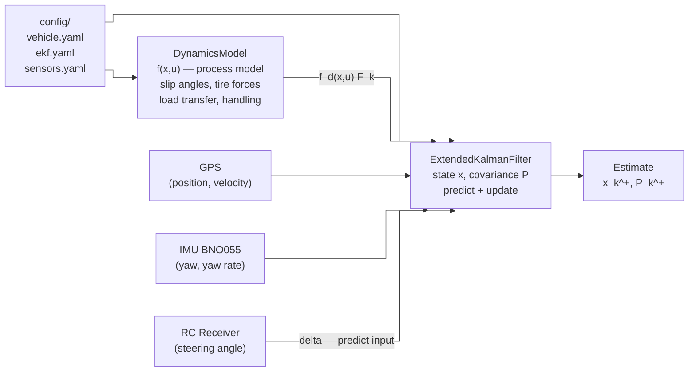
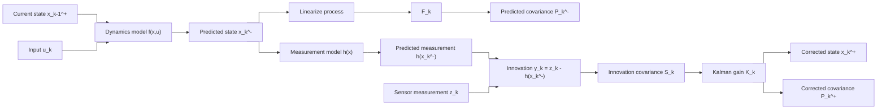
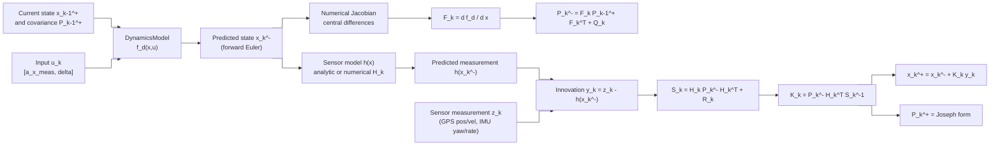
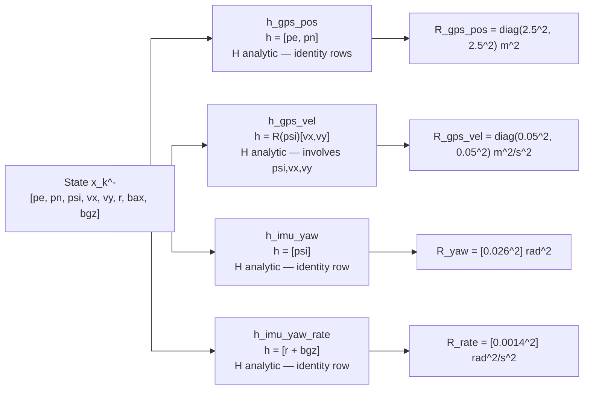

# EKF Process Diagram

This file provides Mermaid diagrams for the current repository EKF flow. It complements `EKF_Explanation.tex` and `EKF_Explanation.md`.

## Software Architecture

`DynamicsModel.py` and `ExtendedKalmanFilter.py` are intentionally separate.
The dynamics model owns **how the car moves** (`f(x,u)`).  The EKF owns
**how confident we are** (`P`) and applies **sensor corrections**.



## High-Level EKF Flow



## Process Model Versus Measurement Model



## Sensor Measurement Models (H matrices)

Each sensor update uses a different `h(x)` function and its Jacobian `H_k`.



## What F_k Means

`F_k` is the state-transition Jacobian:

```text
F_k = d f_d / d x
```

It answers this question:

```text
If the current state estimate changes a little,
how does the predicted next state change?
```

That is why it appears in:

```text
P_k^- = F_k P_k-1^+ F_k^T + Q_k
```
