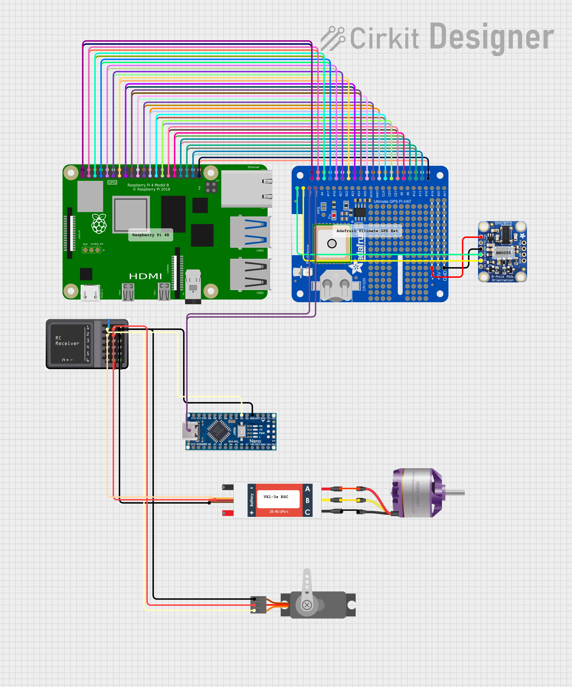
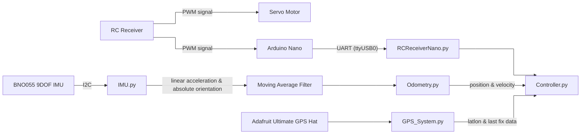

# Capstone-II-Mass-Adjustable-RC-Car-Project

This repository contains the control, sensor, logging, and analysis code for the Northeastern University Mass Adjustable RC Car Capstone II project, advised by Professor Carlos Hidrovo.

Full technical document: https://docs.google.com/document/d/14RuH56wbCEfM_qvJvr-gffSnfkfuiTqH0ljx36ycuP4/edit?usp=sharing


This README is the short, practical setup guide for working in this repository, primarily given a Raspberry Pi that has already been set up. The technical document still is the main entry point to this code, and includes detailed explanation on how to recreate this project from scratch. Implementation using those steps was last tested 4/2026.


## Repository Contents

- `Controller.py` is the main runtime loop. It calibrates the IMU on startup, reads steering data from the Arduino Nano, updates odometry, optionally runs the Extended Kalman Filter, and logs a CSV to `data/`. The navigation pipeline is selected at launch with `--mode`.
- `IMU.py` and `Odometry.py` handle the BNO055 IMU and derived motion estimates.
- `ExtendedKalmanFilter.py` and `DynamicsModel.py` implement the EKF sensor fusion pipeline, loaded automatically when `--mode` is `ekf_imu_only` or `ekf_gps_imu`.
- `RCReceiverNano.py` reads `$STEER,...` messages from the Arduino Nano over serial, usually `/dev/ttyUSB0`.
- `GPS_System.py` wraps `gpsd` and exposes the latest GPS fix for the controller.
- `Plotting.py` plots every numeric column in a CSV log.
- `Animate.py` animates recorded telemetry as a 3D trajectory.
- `Arduino Sketches/` contains the Nano firmware used for RC receiver testing and passthrough.

## Wiring

### Circuit Diagram


> Note: The connection between the Raspberry Pi 4B and the Arduino Nano is via the USB port

### Pinout Summary

Rasperry Pi 4B:

| Peripheral | BCM Pin(s) (BCM numbering) | Notes |
|---|---|---|
| BNO055 IMU (I²C) | SDA → 2 · SCL → 3 | Used by `IMU.py` over Pi I²C. |
| Arduino Nano (RC receiver interface) | USB serial (`/dev/ttyUSB0`) | Steering data in NMEA convention received over serial (UART) with a checksum|
| GPS HAT (gpsd input) | UART RX/TX (`/dev/serial0`) | `GPS_System.py` reads from `gpsd`; the GPS device is typically exposed on `serial0`. |

Arduino Nano:

| Peripheral | BCM Pin(s) (BCM numbering) | Notes |
|---|---|---|
| Raspberry Pi 4B| USB serial (`/dev/ttyUSB0`) | Steering data in NMEA convention sent over serial (UART)|
| RC Receiver | D3 | Steering determined by measuring pulse-width of PWM signal sent to steering servo in parallel|


> Note: The active runtime path in this repository primarily depends on I²C (`BNO055`) and serial (`Arduino Nano`, optional `GPS`). Additional GPIO peripherals from older experiments are not part of the default controller loop.

## Quick Start

### Windows / laptop workflow

Use this path for editing the code, plotting logged data, and lightweight development. Hardware-facing scripts still need a Raspberry Pi with the attached sensors.

1. Install Anaconda to the default location at `%USERPROFILE%\anaconda3`.
2. Create the conda environment expected by the repo:

   ```powershell
   conda create -n bwsi python=3.13 anaconda
   conda activate bwsi
   conda install -c conda-forge utm
   pip install -r requirements.txt
   ```

3. Run local scripts through the wrapper:

   ```powershell
   .\tools\bwsi-python.cmd Plotting.py
   ```

4. VS Code includes matching tasks:
   - `Python: Run active file in bwsi`
   - `Python: Run active file in bwsi (headless)`

`tools\bwsi-python.cmd` assumes either `conda.exe` or `python.exe` exists inside `%USERPROFILE%\anaconda3` and that the environment is named `bwsi`.

### Raspberry Pi / robot workflow

Use this path for IMU, serial receiver, GPS, camera, and GPIO development.

1. Flash Raspberry Pi OS with Raspberry Pi Imager.
2. Set a hostname, enable SSH, and preconfigure Wi-Fi if needed.
   The technical document uses `carpi` as the example hostname.
3. Use your own username and password rather than reusing the example credentials from the original technical document.
4. SSH into the Pi:

   ```bash
   ssh pi@carpi.local
   ```

5. If the host key changed after reflashing:

   ```bash
   ssh-keygen -R carpi.local
   ```

6. Update the system:

   ```bash
   sudo apt update
   sudo apt full-upgrade -y
   ```

7. Enable the interfaces this project uses:

   ```bash
   sudo raspi-config
   ```

   Enable:
   - `SSH`
   - `Camera`
   - `I2C`
   - `Serial Port`

   For the serial prompt inside `raspi-config`, choose:
   - `No` for login shell over serial
   - `Yes` to keep the serial hardware enabled

8. Install base system packages:

   ```bash
   sudo apt install -y python3 python3-pip python3-venv python3-full python3-rpi.gpio gpsd gpsd-clients pigpio
   ```

9. Create and activate a virtual environment in the repo:

   ```bash
   python3 -m venv .venv
   source .venv/bin/activate
   python -m pip install --upgrade pip setuptools
   pip install -r requirements.txt
   ```

10. Install Blinka / CircuitPython support for Raspberry Pi so the BNO055 library can talk to the hardware:

   ```bash
   cd ~
   sudo pip3 install --upgrade adafruit-python-shell --break-system-packages
   wget https://raw.githubusercontent.com/adafruit/Raspberry-Pi-Installer-Scripts/master/raspi-blinka.py
   sudo python3 raspi-blinka.py
   sudo reboot
   ls /dev/i2c* /dev/spi*
   ```

11. If you plan to use `GPS_System.py`, also install the Python gpsd client that provides `from gps import gps`, then configure `/etc/default/gpsd` and verify the receiver with:

   ```bash
   # /etc/default/gpsd
   DEVICES="/dev/serial0"
   GPSD_OPTIONS="-n"
   USBAUTO="true"

   sudo reboot
   cgps
   gpsmon
   sudo ppstest /dev/pps0
   ```

## Running The Code

### Data Flow


### Controller.py — main telemetry loop

Run on the Pi after the IMU, Arduino Nano, and optional GPS hardware are connected:

```bash
source .venv/bin/activate
python Controller.py [FILENAME] [--verbose | --no-verbose] [--mode MODE] [OPTIONS]
```

| Argument | Default | Description |
|---|---|---|
| `FILENAME` | `data` | Base name for CSV output written to `data/` |
| `--verbose` / `--no-verbose` | on | Toggle console output each loop |
| `--mode MODE` | `odometry_only` | Navigation pipeline — see table below |
| `--post-calib` | off | Run stationary IMU post-calibration pass after startup |
| `--post-calib-samples N` | 256 | Samples collected during post-calibration |
| `--post-calib-period SEC` | 0.02 | Seconds between post-calibration samples |
| `--post-calib-gravity` / `--no-post-calib-gravity` | on | Split accel/gravity mismatch during post-calibration |
| `--filter-gyro` | off | Moving-average filter on gyroscope readings |
| `--gyro-window N` | 3 | Gyro moving-average window size |
| `--filter-linear-accel` / `--no-filter-linear-accel` | on | Moving-average filter on linear acceleration |
| `--linear-accel-window N` | 3 | Linear-accel moving-average window size |
| `--low-pass` / `--no-low-pass` | on | First-order low-pass filter on linear acceleration |
| `--low-pass-cutoff HZ` | 2.0 | Low-pass cutoff frequency for linear acceleration |
| `--orientation-low-pass` / `--no-orientation-low-pass` | on | Angle-aware low-pass filter on IMU Euler orientation |
| `--orientation-low-pass-cutoff HZ` | 2.0 | Low-pass cutoff frequency for IMU orientation |

**Navigation modes** (`--mode`):

| Mode | Description |
|---|---|
| `odometry_only` | Pure IMU dead reckoning. No EKF. Baseline for comparison. |
| `ekf_imu_only` | EKF with IMU only — no GPS. Indoor-safe; initialises immediately from BNO055 orientation. |
| `ekf_gps_imu` | Full EKF fusing IMU + GPS. Waits for first GPS fix to set origin. Outdoor use. |

Odometry always runs regardless of mode, so both dead-reckoning and EKF columns appear in every CSV. EKF columns are empty strings when the EKF is not active.

**Examples:**

```bash
# Defaults: odometry_only, verbose on, writes data/data.csv
python Controller.py

# Named session with IMU-only EKF
python Controller.py session_01 --mode ekf_imu_only

# Outdoor GPS+IMU session with tighter filter cutoffs
python Controller.py outdoor_01 --mode ekf_gps_imu --low-pass-cutoff 1.5 --orientation-low-pass-cutoff 1.5

# Disable linear-accel low-pass, enable gyro filter with larger window
python Controller.py raw_test --no-low-pass --filter-gyro --gyro-window 5
```

### Plotting.py — plot a logged CSV

```bash
python Plotting.py [CSV_FILE] [--no-show]
```

| Argument | Default | Description |
|---|---|---|
| `CSV_FILE` | `data/data.csv` | CSV file to plot |
| `--no-show` | off | Build plots without opening an interactive window |

```bash
python Plotting.py                              # plots data/data.csv
python Plotting.py data/session_01.csv         # named run
python Plotting.py data/session_01.csv --no-show  # headless
```

The script accepts either `time` or `runtime` as the time axis column.

### Animate.py — 3D trajectory animation

```bash
python Animate.py [CSV_FILE] [OPTIONS]
```

| Argument | Default | Description |
|---|---|---|
| `CSV_FILE` | `simulated_data.csv` or `data.csv` | Bare filenames resolve inside `data/` |
| `--interval MS` | 80 | Milliseconds between animation frames |
| `--step N` | 1 | Samples to skip between frames (speeds up long runs) |
| `--trail N` | 250 | Number of prior samples visible in the position trail |
| `--save PATH` | — | Save animation to file (`output.gif`, `output.mp4`, etc.) |
| `--fps N` | 15 | Frames per second when saving |
| `--no-show` | off | Build figure without opening an interactive window |
| `--steering-sign` | `negative-left` | Sign convention for logged steering (`negative-left` or `positive-left`) |

```bash
python Animate.py                                      # animates default CSV
python Animate.py session_01.csv --step 2             # faster playback
python Animate.py session_01.csv --save output.gif    # save as GIF
```

### RCReceiverNano.py — read steering data from Arduino Nano

```bash
python RCReceiverNano.py [WARMUP_SECONDS] [FLUSH_BUFFER]
```

| Argument | Default | Description |
|---|---|---|
| `WARMUP_SECONDS` | 0 | Seconds to wait before reading (useful while the transmitter arms) |
| `FLUSH_BUFFER` | `False` | Flush stale serial bytes before reading (`True`/`False`) |

```bash
python RCReceiverNano.py          # read immediately
python RCReceiverNano.py 3 True   # wait 3 s, flush buffer, then read
```

### Hardware bring-up (no arguments)

Run directly on the Pi while bringing hardware online:

```bash
python IMU.py        # calibrate and read BNO055
python Odometry.py   # IMU-based dead reckoning
python GPS_System.py # connect to gpsd and read GPS fixes
```

## Bring-Up Notes

### IMU calibration

The IMU code performs an interactive BNO055 calibration sequence. The startup prompts match the workflow from the technical document:

- Gyroscope: keep the sensor still
- Magnetometer: move the sensor normally or in figure-eight motion
- Accelerometer: place the sensor in six stable orientations

If the IMU reports poor calibration, the orientation and derived odometry values will not be reliable.

### RC receiver voltage safety

Before wiring the RC receiver PWM output into the Pi, verify the signal is around `3.3V` max. If the receiver outputs around `6V`, use a voltage divider or level shifting before connecting it to the Raspberry Pi GPIO input. (i.e. `R1 = 2.7 kOhm` and `R2 = 3.3 kOhm` as one example divider.)

### Serial device name

The Arduino Nano usually appears as:

```bash
ls /dev/ttyUSB*
```

In the current code, `RCReceiverNano.py` defaults to `/dev/ttyUSB0`.
